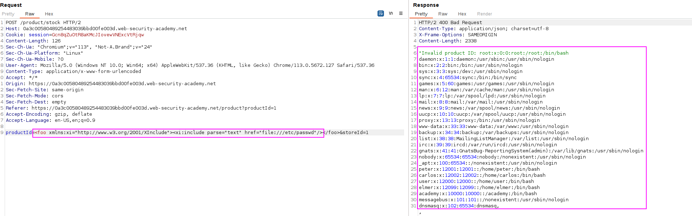

In this case, we cannot control the XML so we cannot declare an XXE variable with the `DOCTYPE` element, but we will add an `XInclude` namespace and provide the path to the file that we want to include. 

In order to do that, as there is not an XML file, we can declare the following payload to add an `XInclude` namespace:

`<foo xmlns:xi="http://www.w3.org/2001/XInclude"><xi:include parse="text" href="file:///etc/passwd"/></foo>`

